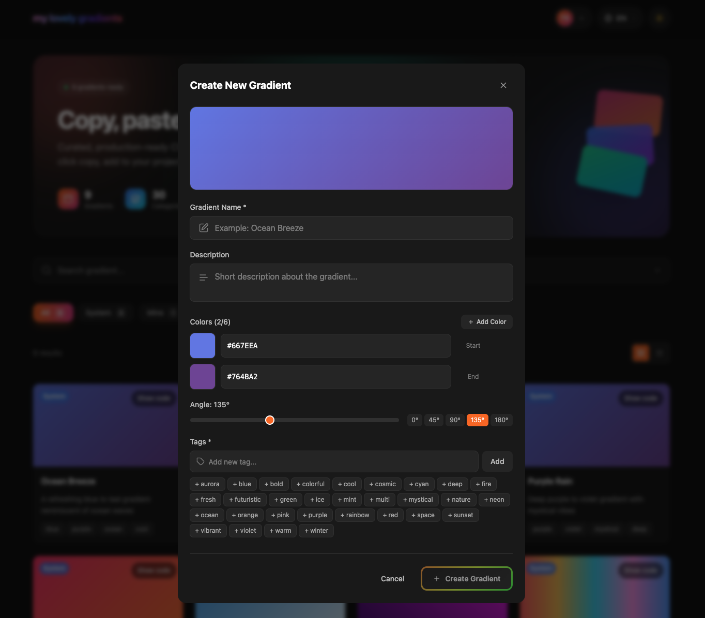
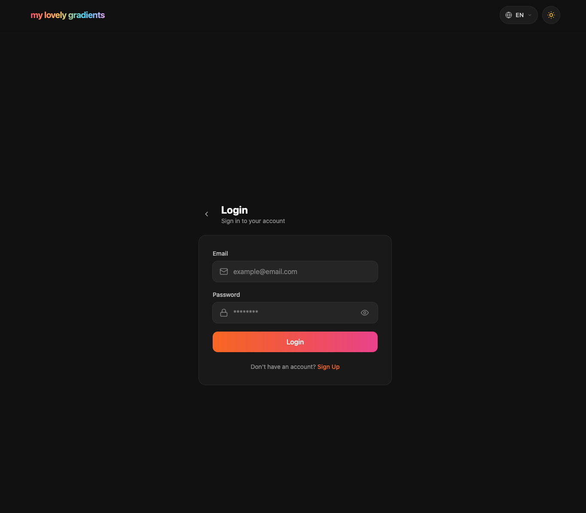
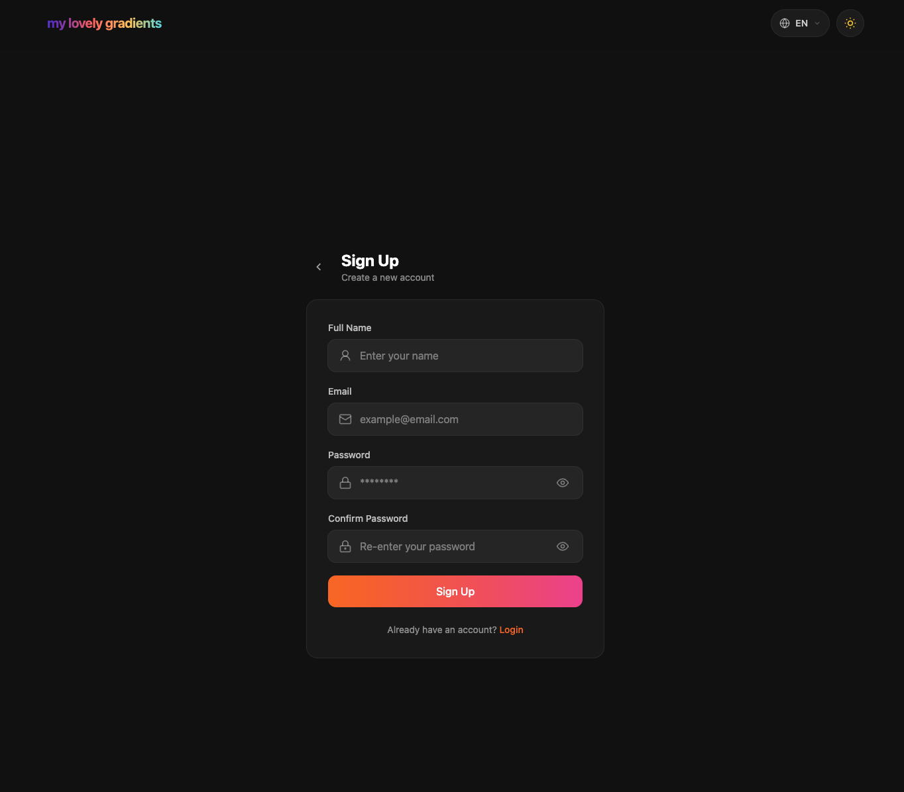

# My Lovely Gradients

A curated collection of production-ready CSS and SCSS gradients. Copy with one click and add to your project.

## Screenshots

<p align="center">
  
</p>

<p align="center">
  
  
</p>

<p align="center">
  
  
</p>

## Features

- **Gradient Collection**: Browse and search through curated gradients
- **One-Click Copy**: Copy CSS or SCSS code instantly
- **User Gradients**: Create and manage your own gradients
- **Multi-language**: Turkish, English, and Arabic (RTL) support
- **Dark/Light Theme**: System preference detection with manual toggle
- **Admin Panel**: Manage all user gradients (admin role)

## Tech Stack

- **Framework**: [Nuxt 3](https://nuxt.com/)
- **Styling**: [Tailwind CSS](https://tailwindcss.com/)
- **Backend**: [Supabase](https://supabase.com/) (Auth, Database, RLS)
- **State**: [Pinia](https://pinia.vuejs.org/)
- **i18n**: [@nuxtjs/i18n](https://i18n.nuxtjs.org/)

## Setup

### Prerequisites

- Node.js 18+
- pnpm (recommended)
- Supabase project

### Installation

```bash
# Clone the repository
git clone https://github.com/your-username/my-lovely-gradients.git
cd my-lovely-gradients

# Install dependencies
pnpm install

# Copy environment variables
cp .env.example .env
```

### Environment Variables

Edit `.env` with your Supabase credentials:

```env
SUPABASE_URL=https://your-project-id.supabase.co
SUPABASE_KEY=your-anon-public-key
```

### Database Setup

Run the following SQL in your Supabase SQL Editor:

<details>
<summary>Click to expand SQL</summary>

```sql
-- Gradients table
CREATE TABLE gradients (
  id UUID DEFAULT gen_random_uuid() PRIMARY KEY,
  user_id UUID REFERENCES auth.users(id) ON DELETE CASCADE,
  name TEXT NOT NULL,
  description TEXT,
  tags TEXT[] NOT NULL DEFAULT '{}',
  angle INTEGER NOT NULL DEFAULT 135,
  colors TEXT[] NOT NULL,
  is_system BOOLEAN NOT NULL DEFAULT FALSE,
  created_at TIMESTAMPTZ DEFAULT NOW(),
  updated_at TIMESTAMPTZ DEFAULT NOW()
);

-- Indexes
CREATE INDEX idx_gradients_user_id ON gradients(user_id);
CREATE INDEX idx_gradients_is_system ON gradients(is_system);

-- RLS
ALTER TABLE gradients ENABLE ROW LEVEL SECURITY;

CREATE POLICY "System gradients visible to all" ON gradients
  FOR SELECT USING (is_system = TRUE);

CREATE POLICY "Users view own gradients" ON gradients
  FOR SELECT TO authenticated USING (user_id = auth.uid());

CREATE POLICY "Users create own gradients" ON gradients
  FOR INSERT TO authenticated
  WITH CHECK (user_id = auth.uid() AND is_system = FALSE);

CREATE POLICY "Users update own gradients" ON gradients
  FOR UPDATE TO authenticated
  USING (user_id = auth.uid() AND is_system = FALSE);

CREATE POLICY "Users delete own gradients" ON gradients
  FOR DELETE TO authenticated
  USING (user_id = auth.uid() AND is_system = FALSE);

-- Admin policies (can view, update, delete all non-system gradients)
CREATE POLICY "Admins view all gradients" ON gradients
  FOR SELECT TO authenticated
  USING ((auth.jwt() -> 'app_metadata' ->> 'is_admin')::boolean = true);

CREATE POLICY "Admins update all gradients" ON gradients
  FOR UPDATE TO authenticated
  USING ((auth.jwt() -> 'app_metadata' ->> 'is_admin')::boolean = true AND is_system = FALSE);

CREATE POLICY "Admins delete all gradients" ON gradients
  FOR DELETE TO authenticated
  USING ((auth.jwt() -> 'app_metadata' ->> 'is_admin')::boolean = true AND is_system = FALSE);

-- Profiles table for user names
CREATE TABLE IF NOT EXISTS profiles (
  id UUID PRIMARY KEY REFERENCES auth.users(id) ON DELETE CASCADE,
  full_name TEXT
);

ALTER TABLE profiles ENABLE ROW LEVEL SECURITY;

-- Users can view their own profile
CREATE POLICY "Users can view own profile" ON profiles
  FOR SELECT TO authenticated USING (id = auth.uid());

-- Admins can view all profiles (for user name badges)
CREATE POLICY "Admins can view all profiles" ON profiles
  FOR SELECT TO authenticated
  USING ((auth.jwt() -> 'app_metadata' ->> 'is_admin')::boolean = true);

-- Trigger for auto-creating profiles
CREATE OR REPLACE FUNCTION public.handle_new_user()
RETURNS TRIGGER AS $$
BEGIN
  INSERT INTO public.profiles (id, full_name)
  VALUES (NEW.id, COALESCE(NEW.raw_user_meta_data->>'full_name', ''))
  ON CONFLICT (id) DO UPDATE
  SET full_name = COALESCE(EXCLUDED.full_name, profiles.full_name);
  RETURN NEW;
END;
$$ LANGUAGE plpgsql SECURITY DEFINER;

DROP TRIGGER IF EXISTS on_auth_user_created ON auth.users;
CREATE TRIGGER on_auth_user_created
  AFTER INSERT ON auth.users
  FOR EACH ROW EXECUTE FUNCTION public.handle_new_user();
```

</details>

## Development

```bash
# Start development server
pnpm dev
```

Open [http://localhost:3000](http://localhost:3000)

## Production

```bash
# Build for production
pnpm build

# Preview production build
pnpm preview
```

## Admin Setup

To make a user an admin, run this SQL in Supabase:

```sql
UPDATE auth.users
SET raw_app_meta_data = raw_app_meta_data || '{"is_admin": true}'::jsonb
WHERE email = 'admin@example.com';
```

## License

MIT
